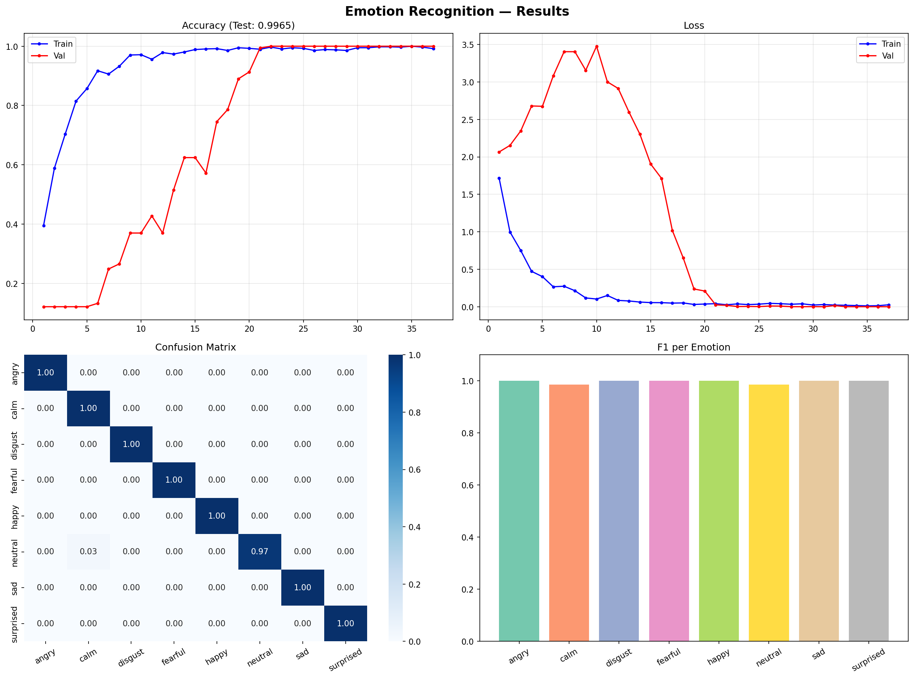

# 🎙️ Emotion Recognition from Speech

> **CodeAlpha Machine Learning Internship — Task 2**

Recognize human emotions from speech audio using Deep CNN + MFCC features.

---

## 📊 Results

### Training & Evaluation Dashboard


---

## 📌 Objective
Detect emotions — happy, sad, angry, neutral, calm, fearful, disgust, surprised — from speech audio.

## 🗂️ Dataset
**RAVDESS** — Ryerson Audio-Visual Database of Emotional Speech
- 24 actors | 8 emotions | 1440+ audio files

## 🔊 Features Extracted (386 total)
| Feature | Dims |
|---------|------|
| MFCCs (mean + std) | 80 |
| Chroma (mean + std) | 24 |
| Mel Spectrogram (mean + std) | 256 |
| Spectral Contrast (mean + std) | 14 |
| Tonnetz (mean + std) | 12 |

## 🤖 Model — Deep 1D-CNN
```
Input → Conv1D(128) → Conv1D(256) → Conv1D(128)
      → Dense(256) → Dense(128) → Dense(8, softmax)
```

## 🚀 Run on Google Colab
1. Upload `emotion_recognition.ipynb` to Colab
2. `Runtime → Change runtime type → GPU`
3. `Runtime → Run All` ✅

## 🛠️ Tech Stack
`Python` · `TensorFlow/Keras` · `Librosa` · `NumPy` · `Matplotlib`

---
*Built with ❤️ during CodeAlpha ML Internship*
